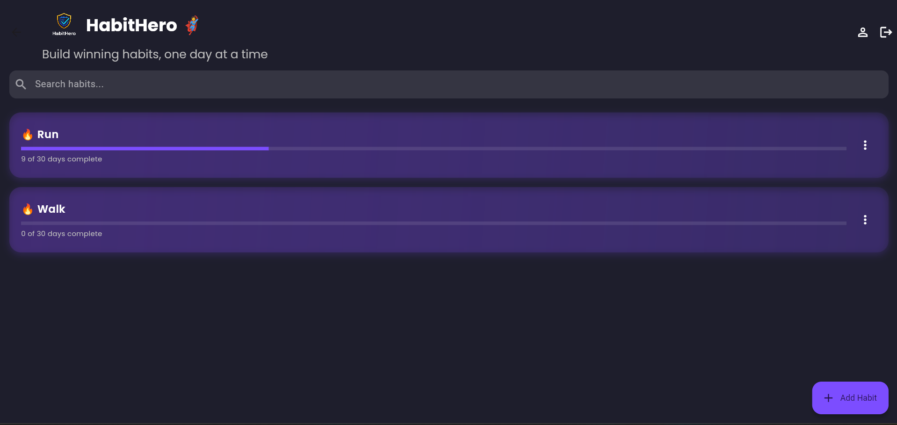
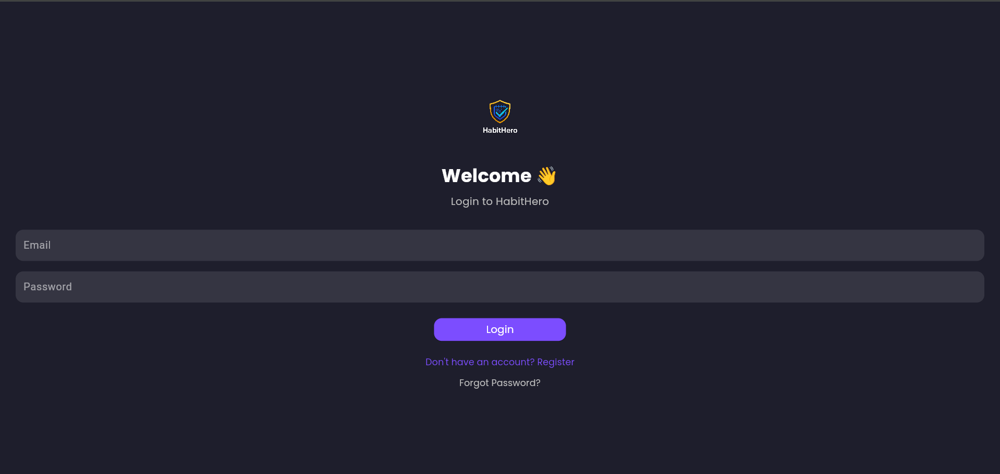
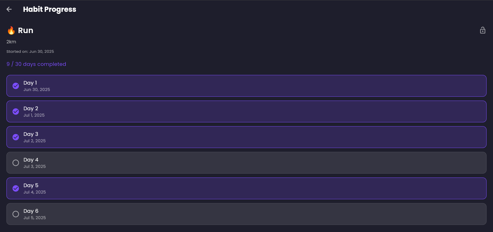

# 🦸 HabitHero

**HabitHero** is a Flutter app designed to help users build strong habits by participating in 30-day challenges. Track your progress, stay consistent, and become the hero of your own life!

---

## 🚀 Features

- ✅ Create new habit challenges
- 📆 Track 30-day progress
- 🔒 Lock/unlock challenges
- 👤 Profile management
- 🔐 Email & Google Sign-In authentication
- 🔁 Forgot password recovery
- 🛠 Admin panel for managing all challenges
- 💡 Clean, responsive, and dark-themed UI

---

## 📸 Screenshots

| Home Screen                                   | Login Screen                                    | Challenge Detail                                  |
|                      |                       |                        |

---

## 🛠️ Tech Stack

- **Flutter** – UI toolkit
- **Firebase** – Authentication & Firestore
- **GetX** – Routing and state management
- **Google Sign-In** – Third-party auth
- **Google Fonts** – Custom typography

---

## 📂 Project Structure

lib/
├── auth_pages/
│   ├── login_page.dart
│   ├── registration_page.dart
├── models/
│   ├── challenge_model.dart
│   └── challenge.dart                  # ✅ NEW: detailed challenge model
├── screens/
│   ├── home_screen.dart
│   ├── create_challenge.dart
│   ├── profile_screen.dart
│   ├── forgot_password_screen.dart
│   └── challenge_detail_screen.dart   # ✅ NEW: screen to view/update challenge
├── services/
│   ├── firestore_service.dart
│   └── auth_service.dart              # ✅ NEW: FirebaseAuth wrapper service
├── widgets/
│   ├── day_tile.dart                  # ✅ NEW: shows a single day's status
│   └── progress_bar.dart              # ✅ NEW: custom progress bar widget
├── main.dart
└── firebase_options.dart

---

## ⚙️ Getting Started

### 1. Prerequisites

- Flutter SDK: [Install Flutter](https://flutter.dev/docs/get-started/install)
- Firebase account: [Firebase Console](https://console.firebase.google.com/)
- Android Studio or Visual Studio Code

